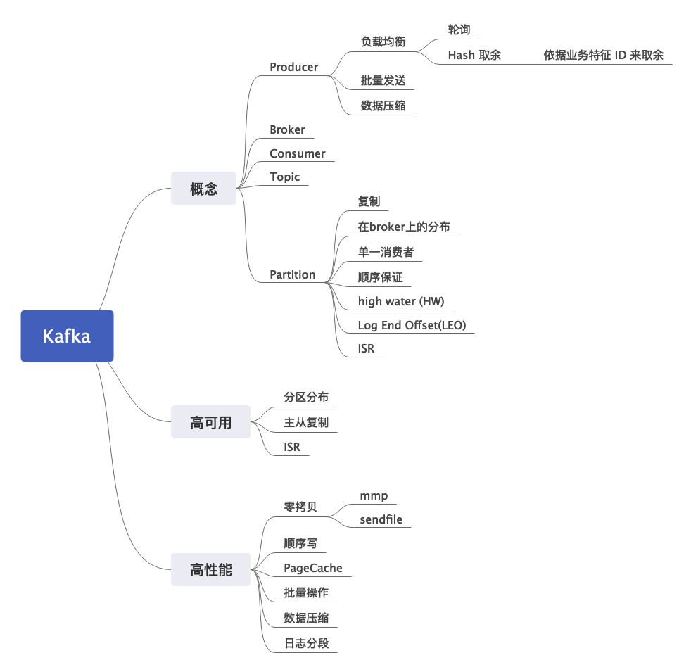

# 你是否了解 Kafka

分析： 如果只是宽泛地谈 Kafka，那么回答的点就要围绕 Kafka 的几个组成来。这个部分不必谈及“为什么 Kafka 高性能” “为什么 Kafka 高可用”等问题。因为按照一般的惯例，接下来就会聊这个话题。总跳回答的思路就是介绍一下 Kafka 的基本原理，几个主要概念。后面详细的内容，等后面面试官来提问。

答：Kafka 是一个基于发布订阅模式的消息队列中间件。它由 Producer, Consumer, Broker 和 Partition 几个组成。

Kafka 里面的每一个消息都属于一个主题，每一个主题都有多个 Partition。Partition 又可以使用主从复制模式，即 Partition 之间组成主从模式。这些 Partition 均匀分布在 Broker 上，以保证高可用。（这里点到了高可用，引导面试官探讨 Kafka 高可用）。每一个 Partition 内消息是有序的，即分区顺序性。（这一句是为了引出后面如何保证消息有序性）

Producer 依据负载均衡设置，将消息发送到 Topic 的特定 Partition 下；（后面面试官可能会问负载均衡策略）

Consumer 之间组成了 Consumer Group，可以有多个 Consumer Group 消费同一个 Topic，互相之间不会有影响。Kafka 强制要求每个 Partition 只能有一个 Consumer，并且 Consumer 采取拉模式，消费完一批消息之后再拉取一批（尝试引出来后面的拉模型的讨论）；

一个 Kafka 集群由多个 Broker 组成，每个 Broker 上存放着不同 Topic 的 Partition；

## 扩展点

### Kafka 的高性能是如何保证的？

分析：必考题。高性能的影响因素有很多，但是常考的就是顺序写 + 零拷贝。在这个问题之下，我们只需要罗列出来各个点，但是不做深入解释。在罗列完之后，我们重点对其中某些点做详细说明，一般我建议用零拷贝做深入阐释。当然，最好是记得所有的点，包括它们的细节，不过这样一回答，没有三五分钟答不完。

答：Kafka 高性能依赖于非常多的手段：
1. 零拷贝。在 Linux 上 Kafka 使用了两种手段，mmap (内存映射，一般我都记成妈卖批，哈哈哈) 和 sendfile，前者用于解决 Producer 写入数据，后者用于 Consumer 读取数据；
2. 顺序写：Kafka 的数据，可以看做是 AOF （append only file），它只允许追加数据，而不允许修改已有的数据。（后面是亮点）该手段也在数据库如 MySQL，Redis上很常见，这也是为什么我们一般说 Kafka 用机械硬盘就可以了。有人做过实验（的确有，你们可以找找，我已经找不到链接了），机械磁盘 Kafka 和 SSD Kafka 在性能上差距不大；
3. Page Cache：Kafka 允许落盘的时候，是写到 Page Cache的时候就返回，还是一定要刷新到磁盘（主要就是mmap之后要不要强制刷新磁盘），类似的机制在 MySQL, Redis上也是常见，（简要评价一下两种方式的区别）如果写到 Page Cache 就返回，那么会存在数据丢失的可能。
4. 批量操作：包括 Producer 批量发送，也包括 Broker 批量落盘。批量能够放大顺序写的优势，比如说 Producer 还没攒够一批数据发送就宕机，就会导致数据丢失；
5. 数据压缩：Kafka 提供了数据压缩选项，采用数据压缩能减少数据传输量，提高效率；
6. 日志分段存储：Kafka 将日志分成不同的段，只有最新的段可以写，别的段都只能读。同时为每一个段保存了偏移量索引文件和时间戳索引文件，采用二分法查找数据，效率极高。同时 Kafka 会确保索引文件能够全部装入内存，以避免读取索引引发磁盘 IO。（这里有一点很有意思，就是在 MySQL 上，我们也会尽量说把索引大小控制住，能够在内存装下，在讨论数据库磁盘 IO 的时候，我们很少会计算索引无法装入内存引发的磁盘 IO，而是只计算读取数据的磁盘 IO）

（批量操作+压缩的亮点）批量发送和数据压缩，在处理大数据的中间件中比较常见。比如说分布式追踪系统 CAT 和 skywalking 都有类似的技术。代价就是存在数据丢失的风险；
（数据压缩的亮点）数据压缩虽然能够减少数据传输，但是会消耗更过 CPU。不过在 IO 密集型的应用里面，这不会有什么问题；

（下面是零拷贝详解）
一般的数据从网络到磁盘，或者从磁盘到网络，都需要经过四次拷贝。比如说磁盘到网络，要经过：

1. 磁盘到内核缓冲区
2. 内核缓冲区到应用缓冲区
3. 应用缓冲区到内核缓冲区
4. 内核缓冲区到网络缓冲

零拷贝则是去掉了第二和第三。（之所以叫零拷贝，并不是说完全没有拷贝，而是指没有CPU参与的拷贝，DMA的还在）。

(这一段可选，因为比较冷僻)如果在 Linux 高版本下，而且支持 DMA gather copy，那么内核缓冲区到

Kafka 利用了两项零拷贝技术，mmap 和 sendfile。前者是用于解决网络数据落盘的，Kafka 直接利用内存映射，完成了“写入操作”，对于 Kafka 来说，完成了网络缓冲区到磁盘缓冲区的“写入”，之后强制调用`flush`或者等操作系统（有参数控制）。（继续补充细节，如果自己是JAVA开发并且记得的话）Java 提供了`FileChannel`和`MappedByteBuffer`两项技术来实现 mmap。

`sendfile`是另外一种零拷贝实现，主要解决磁盘到网络的数据传输。操作系统读取磁盘数据到内存缓冲，直接丢过去`socket buffer`，而后发送出去。很多中间件，例如 `Nignx`, `tomcat` 都采用了类似的技术。

关键字：零拷贝，顺序写，缓冲区，批量，压缩，分段存储

#### 类似问题
- 什么是零拷贝
- 为什么顺序写那么快？
- Kafka 为什么那么快？
- 

#### 如何引导
- 讨论到了零拷贝技术
- 讨论到了顺序写技术

### Kafka 的 ISR 是如何工作的？

分析：考察的是 Partition 同步问题。回答这个问题的时候，要清晰解释清楚，一个 Producer 写入一条消息，到 Partition 同步完成的步骤。亮点在于说清楚，这些步骤如果出现问题会导致什么结果。这里还牵涉到三个基本概念，ISR，HW，LEO。容易混淆的两个时间点，一个是消息写入成功，一个是消息同步成功。这是两个不同的东西。同样，另外一个容易混淆的是，ISR 里面的分区数据和主分区还是有差别的，也就是说，我们认为从分区与主分区保持同步，并不是严格的。

答：ISR 是分区同步的概念。Kafka 为每个主分区维护了一个 ISR，处于 ISR 的分区意味着与主分区保持了同步（所以主分区也在 ISR 里面）。

当 Producer 写入消息的时候，需要等 ISR 里面分区的确认，当 ISR 确认之后，就被认为消息已经提交成功了。ISR 里面的分区会定时从主分区里面拉取数据，如果长时间未拉取，或者数据落后太多，分区会被移出 ISR。ISR 里面分区已经同步的偏移量被称为 LEO（Log End Offset），最小的 LEO 称为 HW（高水位，high water，这个用木桶来比喻就很生动，ISR 里面的分区已同步消息就是木板，高水位就取决于最短的那个木板，也就是同步最落后的），也就是消费者可以消费的最新消息。

当主分区挂掉的时候，会从 ISR 里面选举一个新的主分区出来。

（下面我们进一步解释一下 Producer 写入消息）
我们在 Producer 里面可以控制 ACK 机制。Producer 可以配置成三种：
1. Producer 发出去就算成功；
2. Producer 发出去，主分区写入本地磁盘就算成功；
3. Producer 发出去，ISR 所有的分区都写入磁盘，就算成功；

其性能依次下降，但是可靠性依次上升。

（如果记得，可以补上这个说明）因为 ISR 里面包含了主分区，也就是说，如果整个 ISR 只有主分区，那么全部写入就退化为主分区写入。所以在可靠性要求非常高的情况下，我们要求 ISR 中分区不能少于三个。该参数可以在 Broker 中配置（min.insync.replicas）

（回答到这里，我们基本上就说清楚了 ISR 的基本机制。下面我们横向对比一下 ISR 机制与别的主从同步机制。很明显的，就是 Producer 这种发送策略，是否等待同步完成，在很多中间件上都能看到，随便挑一个出来就可以。我这里总结一下：

ISR 的同步机制和其它中间件机制也是类似的，在涉及主从同步的时候都要在性能和可靠性之间做取舍。通常的选项都是：
1. 主写入就认为成功
2. 主写入，至少一个从写入就认为成功；
3. 主写入，大部分从库写入就认为成功（一般“大部分”是可以配置的，从这个意义上来说，2和3可以合并为一点）；
4. 主写入，所有从库写入就认为成功；

而“写入”也会有不同语义：
1. 中间件写到日志缓存就认为写入了；
2. 中间件写入到系统缓存（page cache）就认为写入了；
3. 中间件强制刷新到磁盘（发起了 fsync）就认为写入了；

都是性能到可靠性的取舍。）

（在面试的时候，可以考虑回答完 ISR 之后，将上面的总结说出来，可以借用 MySQL，Redis, ZK 来说明，这算是一般规律）

#### 类似问题
- Kafka GC 时间过长会导致什么问题？可能导致分区被踢出去 ISR。
- Kafka 是如何保证可靠性的？（除了 ISR 以外，还要强调一下 Partition 是分布在不同 Broker 上，以避免 Broker 宕机导致 Topic 不可用
- 如何提高 Kafka 的可靠性
- 如何提高 Kafka 吞吐量？可靠性和吞吐量在这里就是互斥的，调整参数只能提高一个，降低另外一个。

### 什么时候分区会被移出 ISR？

分析：考察 ISR 的特点，要理解 Kafka 如何维护 ISR 的。其实就两个参数控制，一个是落后多少消息，一个是多久没同步。比较有亮点的是能够清楚答出是哪两个参数，另外一个刷亮点的机会，就是说清楚它们过大过小都会有什么影响。

答案：当分区触发两个条件中的任何一个时，都会被移除出 ISR。
1. 消息落后太多，这个是参数`replica.lag.max.messages`。
2. 分区长时间没有发起`fetch`请求，由参数`replica.lag.time.max.ms`控制。

（刷亮点，点出影响因素，后面面试官跟你探讨这些因素怎么影响的）基本上，除非是新的 Broker，否则几乎都是由网络、磁盘IO和GC引起的，大多数情况下，是负载过高导致的。

（点出过大过小的影响）这两个参数，过小会倒是 ISR 频繁变化，过大会导致可靠性降低，存在数据丢失的风险。

（如果你知道你们公司的配置）我们公司的配置是 XXX 和 XXX。

关键字：落后多少消息，多久没同步

#### 如何引导
- 谈到 Kafka 可靠性可用性

### Kafka 的负载均衡策略有哪些？

分析：一般考察的是 Producer 怎么把消息分到对应的 Partition 上。理论上来说就是两种，一个是轮询，一个是 Hash 取余。这取决于 Key 是否为 Null。但是我们可以结合实际中的一些现实场景，来做一些扩展说明。特别是 Hash 取余。这种问题，列举有什么策略一类的面试题，其实单纯列出来，只能说是合格，要想回答好，就需要针对性地结合自己的经历，重点分析某些策略的优劣。所以我们的回答会先简单介绍有哪些策略，后面会重点落在 Hash 取余上，着重分析 Hash Key 对负载均衡的问题。

最后我们将话题引到 Partition 负载均衡与消费者负载均衡不匹配的问题上。它是指，我们的消息的确分布均匀了，但是处理不同的消息可能有快有慢，在极端情况下，可能处理慢的消息都在特定的 Partition 上，因此导致某个消费者负载奇高，而其余的消费者却没有什么负载。

答案：一般来说有两种，一种是轮询，即 Producer 轮流挑选不同的 Partition；另外一种是 Hash 取余，这要求我们提供 Key。
（接下来，我们讨论 Key 的选择对 Partition 负载的影响，主要是为了体现自己用 Kafka 解决不同问题的思路）

Key 的选取，大原则上是采用业务特征 ID，或者业务特征的某些字段拼接而成。比如说，我们可以考虑按照用 Order ID（可以替换成自己项目里面的某些业务的ID）作为 Key，这意味某个订单的消息肯定落在特定的某个 Partition 上，这就保证了针对该订单的消息是有序的（这里面间接提到了有序性的问题，体现了自己对于 Partition 的理解）。

（说一下 Hash 策略的风险）但是 Hash 策略下，如果 Key 设置不当，可能会导致某些 Partition 承载了大多数的流量。比如说按照商家 ID 来作为 Key，那么可能某些热点商家，大卖家，其消息就集中在某个 Partition 上，导致负载不均衡。

（我们升华一下这个问题，就是这些负载策略实际上都只考虑 Partition 的负载，而没有考虑 Consumer 的负载，为了进一步凸显自己对负载均衡的理解）
无论是轮询，还是 Hash，都无法解决一个问题：它们没有考虑 Consumer 的负载。例如，我们可以用 Hash 策略均匀分布了消息，但是可能某些消息消费得慢，有些消息消费得快。假如说非常不幸我们消费得慢的消息都落在某个 Partition，那么该 Partition 的消费者和别的消费者比起来，消费起来就很慢，带来很大的延迟，甚至出现消息堆积。

关键字：轮询，Hash，Key 的选取

#### 类似的问题
- 如何选取 Hash Key
- 你们是如何设置 Producer 推送消息到哪个 Partition 的？

#### 如何引导
- 在介绍 Kafka 的时候
- 讨论到 Hash Key 选择的时候。其实不仅仅是 Kafka，所有基于 Hash 的负载均衡算法，都会有类似的问题。所谓的 Hash 冲突，也就是这个问题。
- 聊到了消息有序性的时候

### 为什么 Kafka 的从 Partition 不能读取？

分析：考察 Kafka 消费者拉取消息的特点。这个问题的背景是，一般的主从模式，从服务器都可以提供读服务，但是 Kafka 的从 Partition 是不能提供读服务的。所以这也是一个违背一般规律的问题。我们回答的点就要从 Kafka 本身消息存储和消费者消费特点两方面回答。为了方便记忆，以及清楚解释这个问题，我们可以对比 MySQL 的主从模式，假设 Kafka 允许读从 Partition 的数据，会发生什么。

答：首先是 Kafka 自身的限制，即 Kafka 强制要求一个 Partition 只能有一个 Consumer，因此 Consumer 天然只需要消费主 Partition 就可以。

那么假如说 Kafka 放开这种限制，比如说有多个 Consumer，分别从主 Partition 和从 Partition 上读取数据，那么会出现一个问题：即偏移量如何同步的问题。例如一个 Consumer 从 Partition A 读取了 0- 100 的消息，那么另外一个 Consumer 从 Partition B 上读取，就只能读取 100 之后的数据。那么 Kafka 就需要在不同的 Partition 之间协调这个已读取偏移量。而这是分布式一致性的问题，难以解决。

MySQL 的主从模式比起来，并没有这种问题，即 MySQL 不需要进行类似偏移量的协商。

而从另外一个角度来说，Kafka 的读取压力是远小于 MySQL 的，毕竟一个 Topic，是不会有特别多的消费者的。并且 Kafka 也不需要支持复杂查询，所以完全没必要读取从 Partition 的数据。

关键字：偏移量

### 为什么 Kafka 在消费者端采用了拉（PULL）模型？
分析：考察拉模型的特点。回答的关键点在于，对比拉模型和推模型，在 MQ 这种场景下的优缺点。加分点在于明确指出什么 MQ 使用了什么模型。

答：采用拉模型的核心原因在于，消费者的消费速率不同。在拉模型之下，消费者自己消费完毕就自己再去拉去一批，那么这种速率是由消费者自己控制的，所需要的控制信息也是由消费者自己保存的。而采用推模型，就意味着中间件要和消费者就速率问题进行协商，否则容易导致要么推送过快，要么推送过慢的问题。

推模型的一个极大的好处是避免竞争，例如在多个消费者拉同一主题的消息的时候，就需要保证，不同消费者不会引起并发问题。而 Kafka 不会有类似的问题，因为 Kafka 限制了一个 Partition 只能有一个消费者，所以拉模型反而更加合适。

关键字：谁控制，并发竞争

### 如何解决 Topic 数量或者 Partition 数量过多的问题？

### 如何保证消息有序性？方案有什么缺点？

## References
[图解Kafka高可用机制](https://zhuanlan.zhihu.com/p/56440807)
[Kafka高性能原理](https://zhuanlan.zhihu.com/p/105509080)
[Why Kafka is fast](https://preparingforcodinginterview.wordpress.com/2019/10/04/kafka-3-why-is-kafka-so-fast/)